# lmnop:wakeup

**Description:**
`lmnop:wakeup` is a tool for generating daily schedules and morning briefings, integrating with external services like Home Assistant and a weather API.

```mermaid
---
config:
  flowchart:
    curve: linear
---
graph TD;
        __start__(<p>__start__</p>)
        populate_raw_inputs(populate_raw_inputs)
        resolve_location(resolve_location)
        request_weather(request_weather)
        calculate_briefing_day_routes(calculate_briefing_day_routes)
        fork(fork)
        calculate_schedule(calculate_schedule)
        analyze_weather(analyze_weather)
        prioritize_events(prioritize_events)
        write_briefing_outline(write_briefing_outline)
        write_briefing_script(write_briefing_script)
        __end__(<p>__end__</p>)
        __start__ --> populate_raw_inputs;
        populate_raw_inputs --> fork
        populate_raw_inputs --> resolve_location
        resolve_location --> request_weather
        request_weather --> fork
        fork --> calculate_schedule
        fork --> analyze_weather
        calculate_schedule --> prioritize_events
        analyze_weather --> prioritize_events
        prioritize_events --> write_briefing_outline;
        write_briefing_outline --> write_briefing_script;
        write_briefing_script --> __end__;
        classDef default fill:#000,line-height:1.2
        classDef first fill-opacity:.5
        classDef last fill:#999

```



**Features:**
Based on the `cli.py` and the `run.py` files in `brief` and `schedule`, the project provides the following functionalities via the `wakeup` command:
- **Schedule Generation:** Create a daily schedule based on location, date, calendar events, and weather.
- **Briefing Generation:** Generate a morning briefing based on calendar events and detailed weather information. (Note: The CLI command for this appears to be a placeholder currently, but the core logic exists).
- **Weather Testing:** A command to test the weather system integration.

**Setup:**
This project uses `uv` for package management and `opr` for running the code to handle required environment variables from 1Password. Following these steps precisely is MANDATORY for the project to function correctly.

1.  **Install UV:** Follow the official instructions for installing `uv`.
2.  **Install 1Password CLI:** Follow the official instructions for installing the 1Password CLI and setting up `opr`.
3.  **Clone the repository:**
    ```bash
    git clone https://github.com/shyndman/lmnop_wakeup.git
    cd lmnop_wakeup
    ```
4.  **Install dependencies:**
    ```bash
    uv add .
    uv add --dev .
    ```
5.  **Build the project:**
    ```bash
    uv build
    ```
6.  **Configure Environment Variables:** The project requires API keys for Home Assistant and Pirate Weather, which are loaded via `opr` from 1Password. Ensure these are configured in your 1Password vault and accessible via `opr`.

**Usage:**
The main entry point is the `wakeup` command, which MUST be run using `opr`.

-   **Generate Schedule:**
    ```bash
    opr wakeup schedule --current-location <location_name_or_latlng> --todays-date <YYYY-MM-DD> -o <output_path>
    ```
    Example:
    ```bash
    opr wakeup schedule --current-location home --todays-date 2025-05-20 -o schedule.json
    ```
-   **Generate Briefing:**
    ```bash
    # Note: The CLI command for this is currently a placeholder,
    # but the underlying logic exists in src/lmnop_wakeup/brief/run.py
    # Usage will likely involve providing a schedule file path once implemented.
    # opr wakeup brief <schedule_path>
    ```
-   **Test Weather:**
    ```bash
    opr wakeup weather
    ```

**Development & Testing:**
-   Install dev dependencies: `uv add --dev .`
-   Run tests using `opr`:
    ```bash
    opr uv run pytest tests
