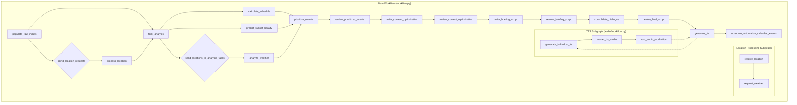

# lmnop:wakeup

**AI-Powered Morning Briefing System**

`lmnop:wakeup` is a sophisticated personal assistant that generates intelligent, personalized morning briefings with natural multi-character dialogue and professional audio production. Using advanced AI orchestration and agent-based architecture, it analyzes your calendar, weather conditions, and locations to create engaging daily briefings that integrate seamlessly with your smart home ecosystem.



## Key Features

### 🧠 **Intelligent Briefing Generation**
- **AI-Powered Analysis**: Uses specialized AI agents for event prioritization, weather analysis, and content optimization
- **Location-Aware Planning**: Automatically resolves event locations and fetches location-specific weather forecasts
- **Smart Event Prioritization**: Determines which calendar events deserve attention based on importance, weather impact, and scheduling
- **Sunset Predictions**: Analyzes weather conditions to predict sunset beauty and outdoor activity recommendations

### 🎭 **Multi-Character Audio Production**
- **Natural Dialogue**: Generates conversations between distinct AI personalities with unique voice characteristics
- **Professional Audio**: Creates production-quality briefings with background music and audio effects
- **Script Optimization**: Intelligently consolidates dialogue to create engaging, natural-sounding conversations
- **TTS Integration**: Uses Google Gemini's advanced text-to-speech with character-specific voice mapping

### 🏠 **Smart Home Integration**
- **Music Assistant Integration**: Seamlessly announces briefings through your smart speaker ecosystem
- **Home Assistant Calendars**: Integrates with Home Assistant calendar entities alongside Google Calendar
- **Automated Scheduling**: Creates automation calendar events for optimal wake-up timing

### ⚡ **Advanced Workflow Orchestration**
- **LangGraph Architecture**: State-driven workflow with PostgreSQL checkpointing and workflow resumption
- **Parallel Processing**: Concurrent location resolution and weather analysis for efficiency
- **Multi-Tier Caching**: Redis and SQLite caching for expensive API operations
- **Interactive Mode**: Human-in-the-loop review steps for content approval and refinement


## Usage

### **Generate Daily Briefing**
```bash
# Generate complete briefing with audio
wakeup --briefing-date 2025-06-10 --current-location home

# Interactive mode with review steps
wakeup --briefing-date 2025-06-10 --current-location home --interactive

# Resume incomplete workflow
wakeup --briefing-date 2025-06-10 --thread-id 2025-06-10-123456
```
